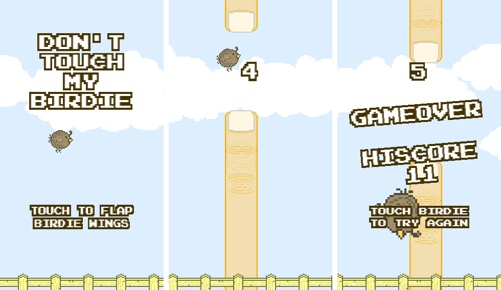

# Don't Touch My Birdie

Un clone del gioco [Flappy Bird](http://en.wikipedia.org/wiki/Flappy_Bird) creato usando il [framework Phaser](http://phaser.io/) e [FireBase]().
Basato sulle repository [HTML5 and Firebase](https://github.com/The-Assembly/Build-a-simple-web-game-with-HTML5-and-Firebase) e 

[Apri il link dal telefono](https://jackdispade21.github.io/provaflappy)

## License

This work is licensed under a [Creative Commons Attribution-NonCommercial 4.0 International License](http://creativecommons.org/licenses/by-nc/4.0/).
